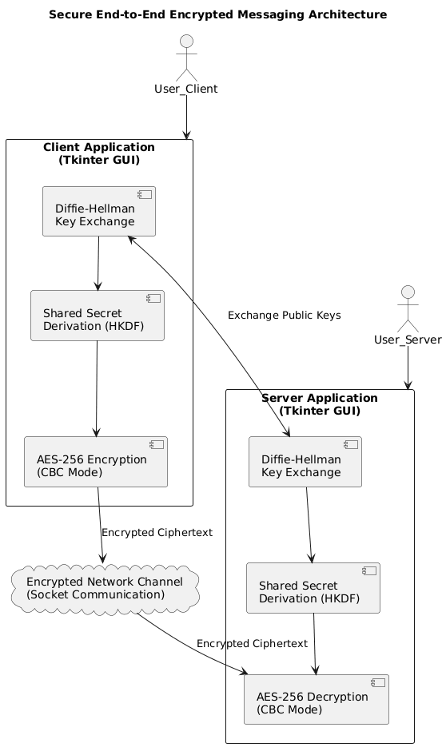
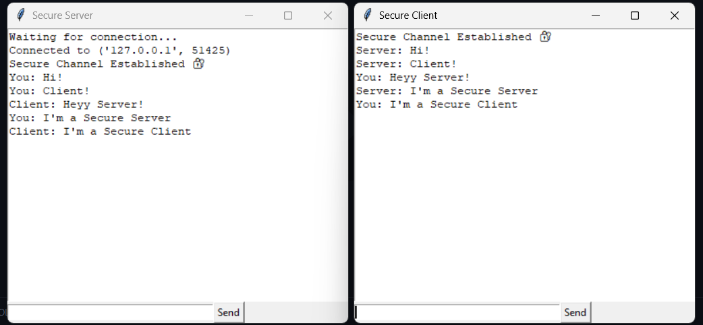
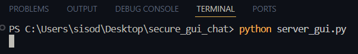
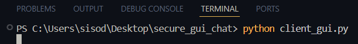

# 🔐 Secure Messaging App (End-to-End Encrypted Chat)

A Python-based secure chat application implementing modern cryptographic protocols to ensure confidentiality and secure key exchange between communicating parties.

## 🚀 Features

- Diffie-Hellman Key Exchange
- AES-256 Encryption (CBC mode)
- Secure Socket Communication
- GUI-based chat interface (Tkinter)
- End-to-End Encryption (E2EE)

## 🛠 Technologies Used

- Python
- Cryptography Library
- Socket Programming
- Tkinter GUI
- Diffie-Hellman
- AES Encryption
- RSA (extensible for digital signatures)

## System Architecture


## 🔐 Security Architecture

1. Diffie-Hellman establishes shared secret
2. HKDF derives secure AES key
3. AES encrypts messages before transmission
4. Encrypted ciphertext transmitted over socket
5. Receiver decrypts locally

No plaintext data is ever transmitted.



## ▶️ How to Run

Install dependencies:

```bash
pip install cryptography
```

Run server:

```bash
python server_gui.py
```



Run client:

```bash
python client_gui.py

```


